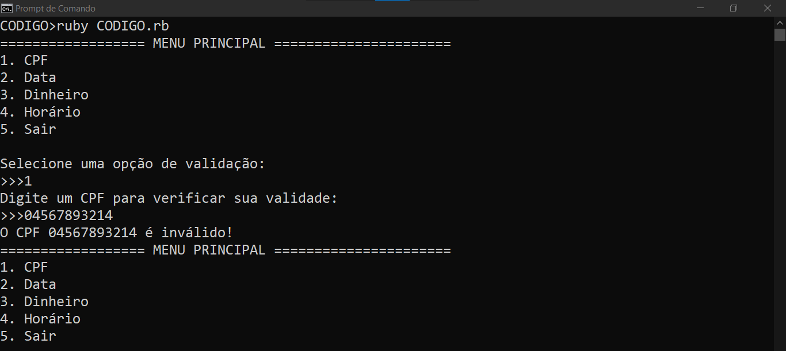
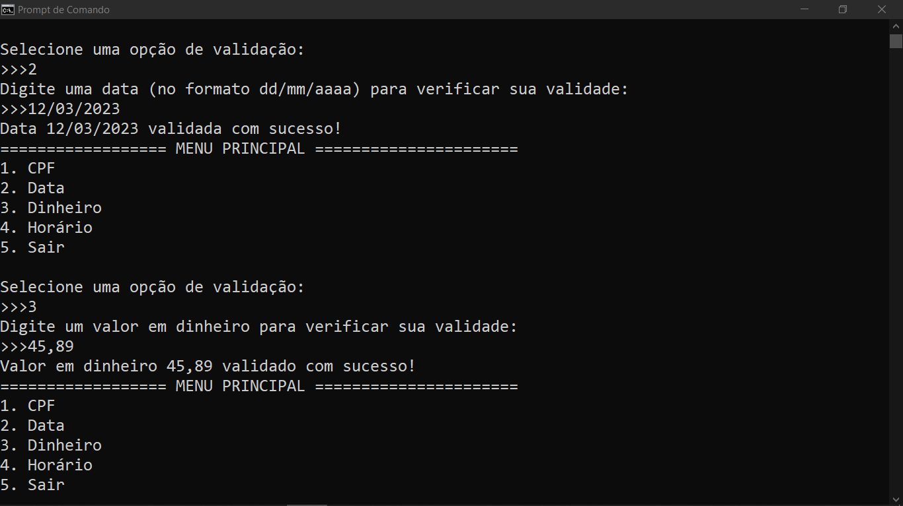
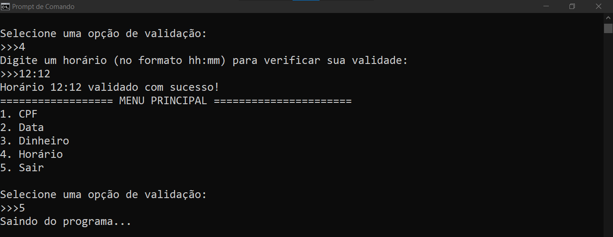
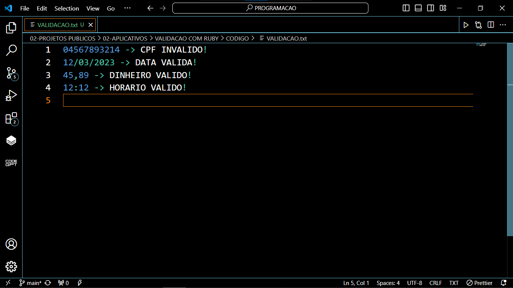

# VALIDACAO COM RUBY
👨‍💻APP DE VALIDAÇÃO COM REGISTROS DE TXT (LOG) PARA CPF, DATA, DINHEIRO E HORÁRIO!

 <br>
 <br>
 <br>
 <br>

## DESCRIÇÃO:
- Este aplicativo em Ruby é um utilitário de validação que permite ao usuário verificar a validade de diferentes tipos de dados: CPF, data, valor em dinheiro e horário. 

- Para cada entrada válida ou inválida, o resultado da validação será salvo no arquivo "VALIDACAO.txt" no mesmo diretório onde o código está sendo executado. Este arquivo de log serve como um registro das validações realizadas pelo aplicativo.

## EXECUTANDO O PROJETO:
1. **Instalação das Dependências:**
   Antes de executar o aplicativo, certifique-se de instalar as dependências do projeto. No terminal, navegue até o diretório `./CODIGO` e execute o comando abaixo para instalar as dependências necessárias:
   ```bash
   bundle install
   ```

2. **Executando o Aplicativo:**
   Após instalar as dependências, ainda no terminal e no mesmo diretório (`./CODIGO`), execute o seguinte comando para iniciar o aplicativo:
   ```bash
   ruby "CODIGO.rb"
   ```

3. **Usando o APP:**
   1. **Menu de Opções:**
      - Após iniciar o programa, você verá um menu com opções de validação disponíveis.
      - O menu exibirá opções para validar CPF, horário e outros tipos de dados.

   2. **Seleção de Opção:**
      - Escolha a opção desejada digitando o número correspondente e pressionando Enter.
      - Por exemplo, se você deseja validar um CPF, digite "1" e pressione Enter.

   3. **Entrada de Dados:**
      - Siga as instruções fornecidas pelo programa para inserir os dados a serem validados.
      - Por exemplo, se solicitado a digitar um CPF, insira o CPF desejado e pressione Enter.

   4. **Resultado da Validação:**
      - O programa verificará os dados fornecidos e informará se são válidos ou inválidos.
      - O resultado da validação será exibido no terminal.

   5. **Registro em Arquivo:**
      - Além da exibição no terminal, os resultados da validação são registrados no arquivo "VALIDACAO.txt".
      - Este arquivo estará localizado no mesmo diretório onde o programa está sendo executado.

   6. **Continuação ou Saída:**
      - Após verificar um tipo de dado, você pode optar por validar outro ou sair do programa.
      - Se desejar continuar, o menu de opções será exibido novamente para selecionar outra opção.
      - Para sair do programa, escolha a opção correspondente no menu ou pressione "Ctrl + C" no terminal.

## NÃO SABE?
- Entendemos que para manipular arquivos em muitas linguagens, é necessário possuir conhecimento nessas áreas. Para auxiliar nesse aprendizado, oferecemos cursos gratuitos disponíveis:
* [CURSO DE RUBY](https://github.com/VILHALVA/CURSO-DE-RUBY)
* [CONFIRA MAIS CURSOS](https://github.com/VILHALVA?tab=repositories&q=+topic:CURSO)

## CREDITOS:
- [PROJETO CRIADO PELO VILHALVA](https://github.com/VILHALVA)


